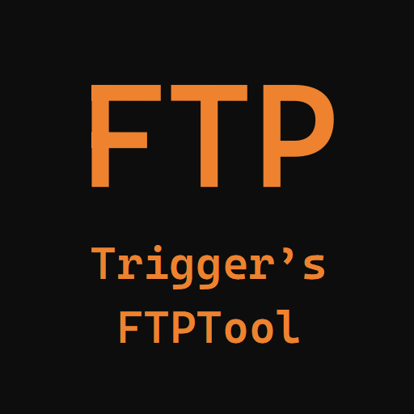
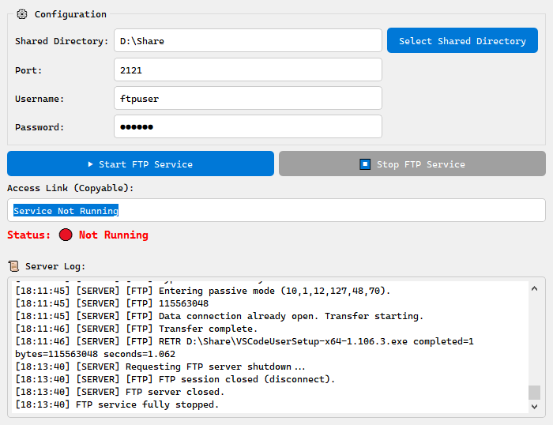

# LAN FTP Tool



## 概述

LAN FTP Tool 是一个简单的本地网络 FTP 服务器管理工具，基于 PyQt5 和 pyftpdlib 实现。它允许用户在局域网内快速搭建一个 FTP 服务器，并提供图形界面来管理服务器配置和状态。该工具适用于在不需要复杂配置的情况下，快速分享文件到局域网内的其他设备。



## 主要功能

1. **启动/停止 FTP 服务**：用户可以通过图形界面启动和停止本地 FTP 服务器。
2. **配置管理**：允许用户指定共享目录、端口、用户名和密码，并提供保存和加载配置的功能。
3. **日志记录**：显示服务器启动、运行及关闭的详细日志，便于跟踪和调试。
4. **访问链接复制**：提供方便的 FTP 访问链接，可以直接复制到其他设备上使用。

## 环境要求

- Python 3.6 及以上
- PyQt5
- pyftpdlib

## 安装

1. 确保已安装 Python 3.6 及以上版本。
2. 安装所需库：

    ```bash
    pip install PyQt5 pyftpdlib
    ```

3. 下载或克隆此仓库到本地，确保包含 `FTPTool.py` 文件。

## 使用方法

1. **运行程序**
   打开终端或命令提示符，导航到包含 `FTPTool.py` 的目录，然后运行：

   ```bash
   python FTPTool.py
   ```

   或者，您也可以根据您的 Python 安装路径使用相应的命令来运行。

2. **配置服务**
   - **共享目录**：指定您希望共享的文件夹路径。
   - **端口**：选择一个未被占用的端口号（默认为2121）。
   - **用户名和密码**：设置访问FTP服务器所需的用户名和密码。

3. **启动服务**
   点击“启动 FTP 服务”按钮，启动 FTP 服务器。启动成功后，您将在“访问链接”框中看到包含服务器IP、端口、用户名和密码的链接。

4. **停止服务**
   点击“停止 FTP 服务”按钮，停止 FTP 服务器。停止服务后，界面将更新相应的状态信息。

## 注意事项

- 选择的端口号需要在 1024 到 65535 之间。
- 在 Windows 系统中，为了防止中文乱码，FTP 处理程序使用 `gbk` 编码，请确保您的文件名和目录名兼容此编码。
- 请确保您有权限访问和修改指定的共享目录。

## 贡献

欢迎您对本项目的贡献！您可以通过提交问题、功能请求或代码修改来参与开发。

## 许可证

本项目采用 MIT 许可证。详情请参阅 `LICENSE` 文件。
